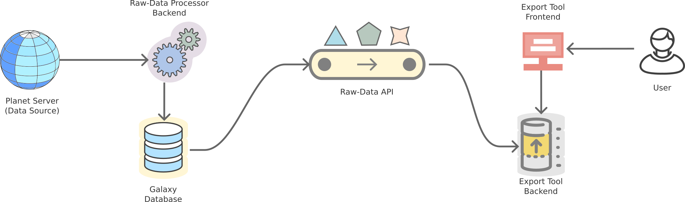

# Architecture


## Introduction to the raw-data API

The raw data API consists of two parts:

 - The Backend - composed of LUA and Python scripts that fetch Openstreetmap data in osm.xml format and transform them into geometry that can be stored on PostGIS-compatible PostgreSQL database.
 - The API - the programming interface to the backend that exposes a ReST endpoint to make calls to the database.



The API is then used by Export Tool to fetch and export geometry data - transformed into various formats - on demand. This service is not public and is currently exposed only to the export tool instances. There are a few criteria to what OSM elements (nodes, ways, relations) are transformed into geometry (points, lines - `ways_line`, polygons `ways_poly`) - specifically, only elements with tags are exported into the raw-data database.

## Component architecture

 - The API registers the workers to redis.
 - When the workers come up - they have knowledge of redis - they pick up a task from the job queue
 - The workers then pull data from the database to process data
 - Redis carries several responsibilities 
   - Act as a task queue
   - Act as a registry for workers (workers are spawned with the knowledge of redis to which they register and from which they pick up jobs - one at a time)

```

              +------------+       +-------+      +-----------+
              |            +------>|       +------>           |
(^_^) -------->  Frontend  |       |  API  <------+  Backend  |
              |            |<------+       |      |           |
Users         +------------+       +--+--^-+      +--+-----^--+
                                      |  |           |     |
                                      |  |           |     |
                                      |  |           |     |
                                      |  |         +-v-----+--+
                                      |  +---------+          |
                                      |            | Database |
                                      +------------>          |
                                                   +----------+

              ┌────────────┐       ┌───────┐      ┌───────────┐
              │            ├──────►│       └──────►           │
(^_^) ────────►  Frontend  │       │  API  ◄──────┐  Backend  │
              │            │◄──────┤       │      │           │
Users         └────────────┘       └──┬──▲─┘      └──┬─────▲──┘
                                      │  │           │     │
                                      │  │           │     │
                                      │  │           │     │
                                      │  │         ┌─▼─────┴──┐
                                      │  └─────────┤          │
                                      │            │ Database │
                                      └────────────►          │
                                                   └──────────┘
```

## Deployment

### Capacity planning

- Database disk space - 2TB - 5TB

### Requirements

- Redis - Acts as a broker and message queue
- Dramatiq - worker management queues

### Deployment Order

1. Backend scripts
2. API service
3. Utility scripts - Deployment not necessary.


## Export Tool issues

- Export tool (backend) still uses Python 2.
- Because Export tool is legacy and fragile, we need to deploy the raw-data API - which export tool backend relies on to fetch data - to a separate VM

## Troubleshooting

- Check if the backend service is up and running using 

```
systemctl status rawdata-update.service
systemctl status poll.service
```

- Check if the API service is up and running using systemctl
- In extreme cases, we might have to load-data manually and then start the services
